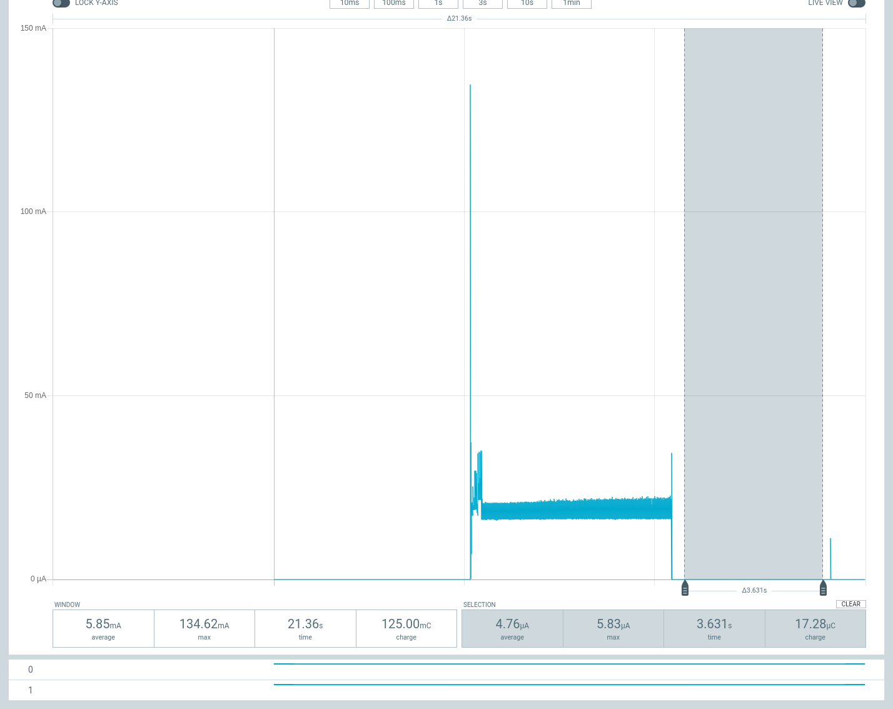

# ESP32-C3-WROOM-02-N4 Breakout Board

## Objective

Make a low cost ESP32-C3 board that can run efficiently from 3x AA lithium
batteries.

## Power Consumption

### Deep Sleep (WROOM only)

## Price

## PCB

## BOM

### Firmware

https://github.com/fgervais/project-idf-c3-test/tree/master/first_arduino_test
